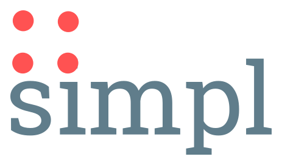

:linkattrs:
:source-highlighter: rouge

==== simplchat(xmpp chat, running in the browser over websocket) ====

==== link:http://simplchat.ms123.org/repo/simplchat/start.html[Demo,window="_blank"] ====

[NOTE]
====
In order to have a counterpart, you can use an link:http://xmpp.org/software/clients.html[standard XMPP client(eg. Pidgin),window="_blank"]. +
But it is also possible to log on  in two windows(tabs) with this client.

*Logindata:*

. chat1/chat1
. chat2/chat2
. chat3/chat3

The domain is simpl4.org. +

====

=== Overview ===

==== scope  ====

* single chat ( one to one )
* mixed chat
* chat rooms

==== involved components ====

* openfire xmpp server ( integrated in simpl4)
* xmpp camel endpoint (link:http://www.igniterealtime.org/projects/smack/[wraps smack: a xmpp(japper) client library,window="_blank"])
* a small camel route, connects the xmpp endpoint with an  websocket
* websocket
* javascript user interface implemented as html5 customelement +
( can be integrated into other websites )

{nbsp} +
{nbsp} +
--
[role=border]
image::http://simpl4first.simpl4.org/repo/simplchat/web/images/xmpp-ws.svg[align="center", scaledWidth=50%]
--
